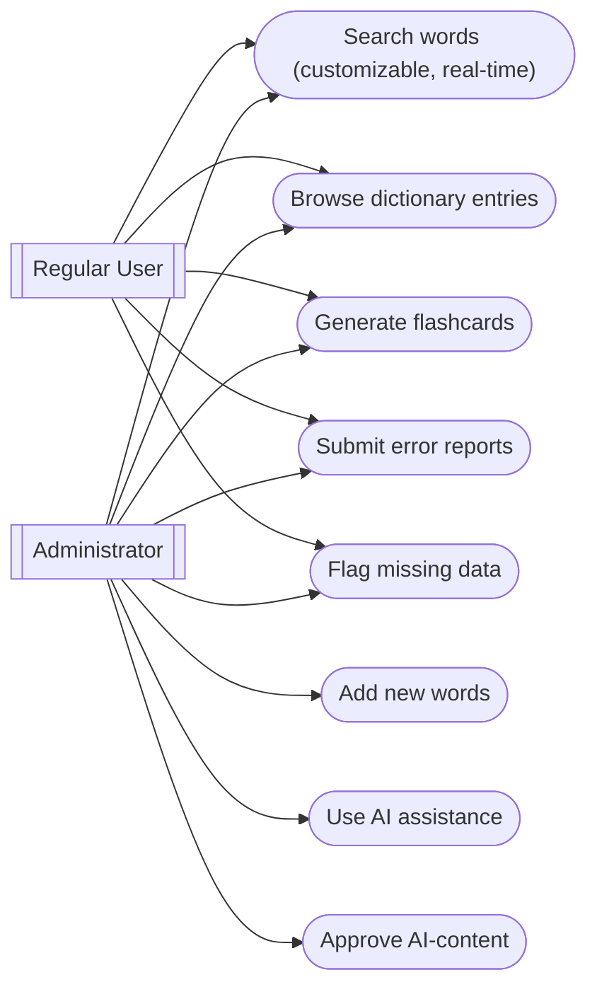
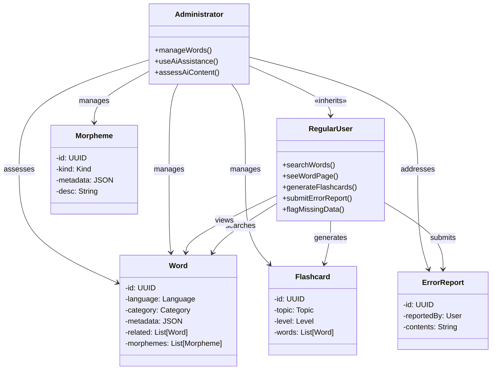
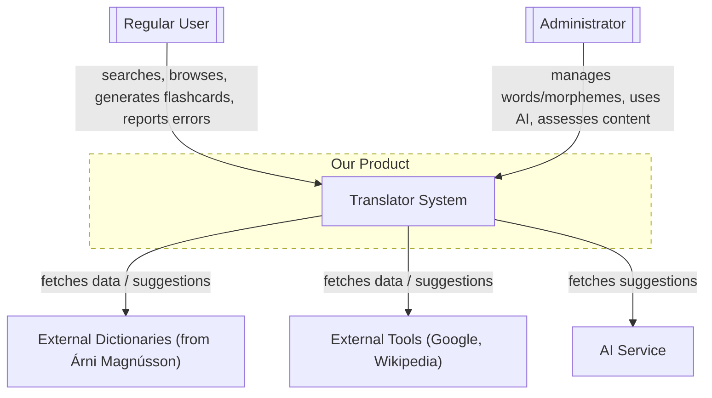
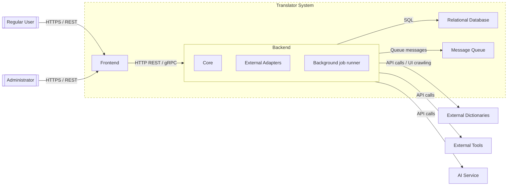
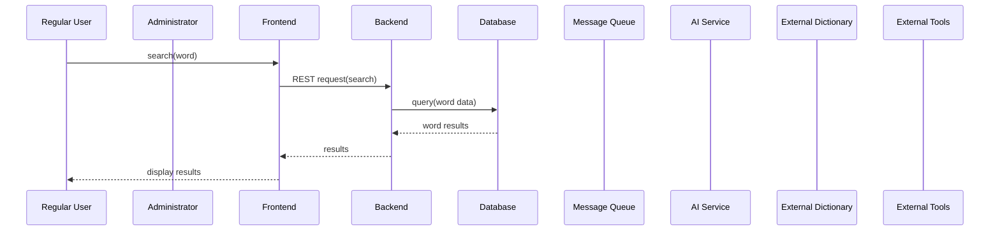
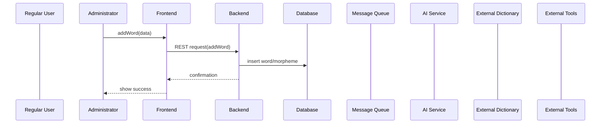
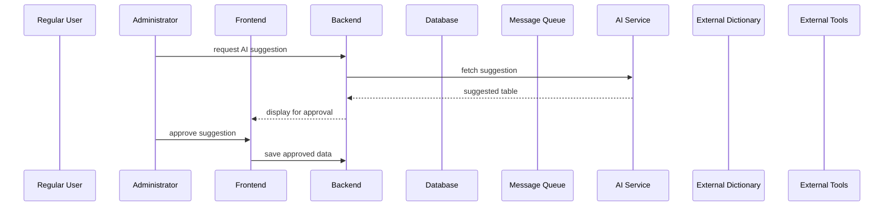
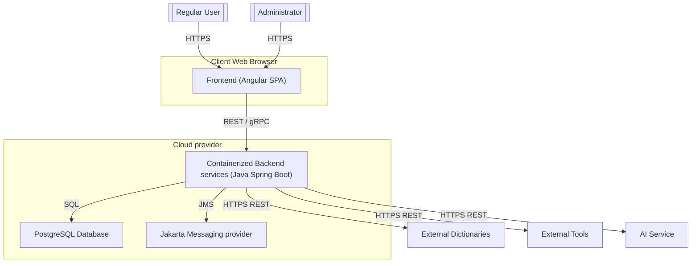

# Architecture Description

## Background
- The motivation of the project is to support learning the Icelandic language. Icelandic is a synthetic (more precisely, inflectional) language with many exceptions. In learning such a language, tables, flashcards, and analytical explanations are critically important
- Similar tools already exist on the market. The official sources are two web applications from the Árni Magnússon Institute: BÍN (https://bin.arnastofnun.is/), which is an interactive inflection table, and an explanatory one-language dictionary (https://islenskordabok.arnastofnun.is/)
- In addition, Google, Wikipedia, and AI-based tools are of course available
- The goal of our project is to unify inflection handling AND a multilingual dictionary within a custom-built system
- We decided to model linguistic concepts at the **morpheme** level, map them to an intermediate conceptual system (roughly an _interlingua_), and generate the individual target languages from that representation
- This decision is not “business-rational”, as it is a difficult path and hard to scale; however, this project is a technical playground / case study, and supporting languages beyond Hungarian–Icelandic and possibly English is explicitly out of scope

## Most Important FRs
- An **administrator** user must be able to **add** new words (morphemes), even partially (partial inflection, partial translation)
- An **administrator** must be able to use **AI assistance** to suggest a declension table, etc., but everything must require explicit approval by a human actor
- A **regular user** must be able to **search**; the search must be customizable (language, part of speech, extended forms vs. dictionary form only), and must provide a fast, real-time matching list
- A **regular user** must be able to **browse** dictionary entries and view translations
- A **regular user** must be able to generate vocabulary **flashcards** for different topics, languages, and proficiency levels
- A **regular user** must be able to submit **error reports** and optionally **flag missing data** that they personally need
- An **administrator** must be able to do everything a **regular user** can do

## Domain Model

## Most Important NFRs
- **Search performance must be acceptable** even when searching across multiple linguistic levels and languages; the upper bound should be on the order of seconds. If this cannot be met, the UX must communicate the risks clearly to the user or at least display a status/progress indicator
- It must be **clearly auditable** what content is AI-generated, what is AI-generated but human-approved, and what is purely human-entered, as a core concept of the project is to build an explainable model
- **Maintainability** and overall **software quality** are important *l’art pour l’art*, as the project is a case study rather than an industrial or commercial application
- _We do not handle sensitive user data; input throughput is not critical; scalability is currently not a concern; no SLA is provided_

## Baseline Architecture

### Arc42 Business Context Diagram

### Arc42 Technical Context Diagram

### Additional Views of the Architecture

#### Dynamic View (Sequence / Interaction) -- examples

#### Deployment View

## Design Decisions
- **Backend** modules use the latest **Java LTS** version (25) and the **Spring Boot** framework
- **PostgreSQL** is used as the database
- For _synchronous_ communication (backend–backend and frontend–backend), **HTTP(S)** calls are used; for _asynchronous_ communication, a **queuing system** is used (Jakarta Messaging, provider TBD)
- The frontend will be monolithic and will use the **Angular** framework
- Everything is **containerized**, and deployment is done using the **render.com** free service
